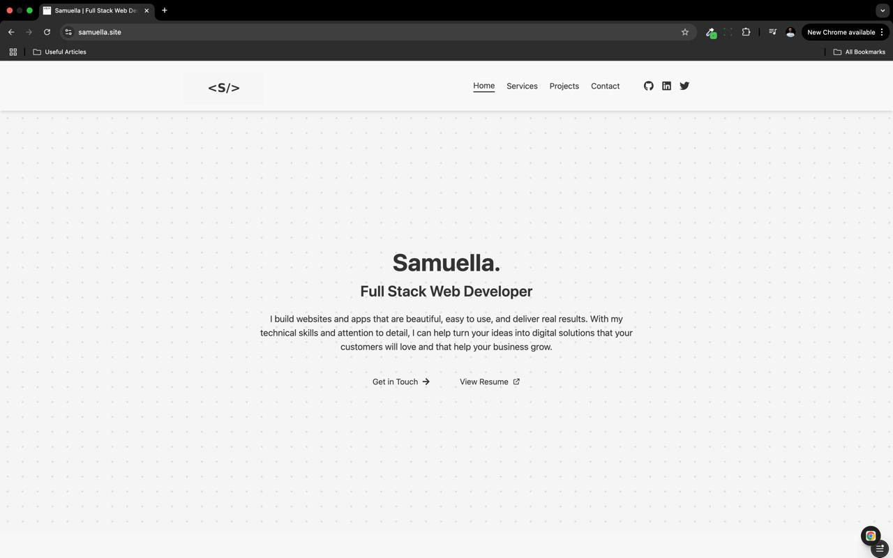

# Samuella's Portfolio Website

A modern, responsive portfolio website built with Next.js 15 and Tailwind CSS, showcasing my skills, services, and projects as a Full Stack Web Developer.



## 🌟 Features

- **Modern Tech Stack**: Built with Next.js 15 (App Router), TypeScript, and Tailwind CSS
- **Responsive Design**: Fully responsive layout that looks great on all devices
- **Performance Optimized**: Fast loading times with optimized images and code splitting
- **SEO Friendly**: Comprehensive metadata, Open Graph tags, and structured data
- **Contact Form**: Functional contact form with email notifications
- **Dark Mode**: Elegant dark theme for the header and accent elements
- **Animations**: Subtle animations and transitions for an engaging user experience
- **MongoDB Integration**: Backend database for storing contact form submissions
- **API Routes**: Server-side API routes for handling form submissions

## 🚀 Live Demo

Visit the live portfolio at [samuella.site](https://www.samuella.site)

## 🛠️ Tech Stack

- **Frontend**:
  - Next.js 15 (App Router)
  - TypeScript
  - Tailwind CSS
  - React Icons

- **Backend**:
  - Next.js API Routes
  - MongoDB (with Mongoose)
  - Nodemailer for email notifications

- **Deployment**:
  - Vercel

## 📂 Project Structure

```
portfolio-website/
├── app/                     # App Router directory
│   ├── api/                 # API routes
│   │   ├── contact/         # Contact form API
│   │   └── projects/        # Projects API
│   ├── contact/             # Contact page
│   ├── projects/            # Projects page
│   ├── services/            # Services page
│   ├── globals.css          # Global styles
│   ├── layout.tsx           # Root layout
│   ├── page.tsx             # Home page
│   ├── sitemap.ts           # Sitemap generator
│   └── robots.ts            # Robots.txt generator
├── components/              # Reusable UI components
│   ├── Contact.tsx          # Contact form component
│   ├── Footer.tsx           # Footer component
│   ├── Header.tsx           # Header component
│   ├── Hero.tsx             # Hero section component
│   ├── ProjectCard.tsx      # Project card component
│   ├── Projects.tsx         # Projects section component
│   ├── Services.tsx         # Services section component
│   └── Skills.tsx           # Skills section component
├── lib/                     # Utility functions
│   ├── constants.ts         # Site constants
│   └── mongo.ts             # MongoDB connection utility
├── models/                  # MongoDB models
│   ├── Message.ts           # Contact message model
│   └── Project.ts           # Project model
├── public/                  # Static assets
│   ├── images/              # Images
│   │   ├── og-image.jpg     # Open Graph image
│   │   ├── profile.jpg      # Profile picture
│   │   └── projects/        # Project images
│   ├── resume/              # Resume files
│   └── favicon.ico          # Favicon
├── .env.local               # Environment variables
├── next.config.js           # Next.js configuration
├── package.json             # Project dependencies
├── postcss.config.js        # PostCSS configuration
├── tailwind.config.js       # Tailwind CSS configuration
└── tsconfig.json            # TypeScript configuration
```

## 🏁 Getting Started

### Prerequisites

- Node.js 18.x or later
- npm or yarn
- MongoDB database

## 📄 License

This project is licensed under the MIT License - see the LICENSE file for details.

## 📬 Contact

Samuella - [samuellamanyeaglago@gmail.com](mailto:samuellamanyeaglago@gmail.com)

Project Link: [https://samuella.site](https://github.com/yourusername/portfolio-website)

---

⭐️ If you found this portfolio template helpful, please consider giving it a star on GitHub!